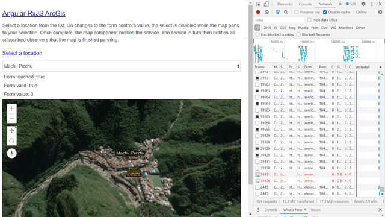

# :zap: Angular RxJS ArcGIS

* Angular app using RxJS operators and the ArcGIS API mapping solution from [Esri](https://www.esri.com/en-us/home) with [esri-loader](https://github.com/Esri/esri-loader).
* Code by Andy Gupp at esri - see [:clap: Inspiration](#clap-inspiration) below - updated to the latest Angular/dependency versions
* **Note:** to open web links in a new window use: _ctrl+click on link_


## :page_facing_up: Table of contents

* [:zap: Angular RxJS ArcGIS](#zap-angular-rxjs-arcgis)
  * [:page_facing_up: Table of contents](#page_facing_up-table-of-contents)
  * [:books: General info](#books-general-info)
  * [:camera: Screenshots](#camera-screenshots)
  * [:signal_strength: Technologies](#signal_strength-technologies)
  * [:floppy_disk: Setup](#floppy_disk-setup)
  * [:flashlight: Testing](#flashlight-testing)
  * [:computer: Code Examples](#computer-code-examples)
  * [:cool: Features](#cool-features)
  * [:clipboard: Status & To-Do List](#clipboard-status--to-do-list)
  * [:clap: Inspiration](#clap-inspiration)
  * [:file_folder: License](#file_folder-license)
  * [:envelope: Contact](#envelope-contact)

## :books: General info

* [ArcGIS API for Javascript CDN](https://developers.arcgis.com/javascript/latest/guide/get-api/#cdn) link in `esri-map` component.
* [ArcGIS for Developers](https://developers.arcgis.com/) offers a full suite of tools and resources to build mapping and analytics solutions. Use ArcGIS APIs to create location-based applications for web, desktop, and mobile devices.
* RxJS subscriptions objects used to represents the execution of observables.
* Note: RxJS version 6.6.6 used - do not update to v7 as it is not compatible with Angular v11

## :camera: Screenshots



## :signal_strength: Technologies

* [Angular v12](https://angular.io/)
* [Angular Formcontrol](https://angular.io/api/forms/FormControl)
* [Esri-loader v3](https://github.com/Esri/esri-loader) library to use the ArcGIS API for JavaScript
* [ArcGIS API for JavaScript v4.18](https://developers.arcgis.com/javascript/) mapping and analytics software
* [@types/arcgis-js-api v4.18.0](https://www.npmjs.com/package/@types/arcgis-js-api) type definitions for ArcGIS API for JavaScript
* [RxJS Library v6](https://angular.io/guide/rx-library) used to handle async operations using observables

## :floppy_disk: Setup

* Install dependencies by running `npm i`
* Run `ng test` for Jasmine tests carried out in Karma console
* Run `ng serve` for a dev server. Navigate to `http://localhost:4200/`.
* The app will automatically reload if you change any of the source files

## :flashlight: Testing

* Run `ng test` to execute the unit tests via [Karma](https://karma-runner.github.io).
* Run `ng e2e` to execute the end-to-end tests via [Protractor](http://www.protractortest.org/).

## :computer: Code Examples

* extract from `control-panel.component.ts` to pan to map view in 2s

```typescript
panMap(coordinates: string) {
    this.mapView.goTo(coordinates).then(() => {
      this.mapView.zoom = 18;
      setTimeout(() => {
        this.mapService.panToWonderComplete();
      }, 2000);
    });
  }
```

## :cool: Features

* map view pan function

## :clipboard: Status & To-Do List

* Status: Working. Passing 2 out of 4 tests, issue with provider of EsriMapService, e2e testing fails.
* To-Do: Fix errors

## :clap: Inspiration

* [ArcGIS API for JavaScript: Building Apps with Angular](https://www.youtube.com/watch?v=ea4D-qGU0_0)
* [#ANGULAR, Deploying an Angular App to Firebase Hosting](https://alligator.io/angular/deploying-angular-app-to-firebase/)

## :file_folder: License

* This project is licensed under the terms of the MIT license.

## :envelope: Contact

* Repo created by [ABateman](https://github.com/AndrewJBateman), email: gomezbateman@yahoo.com
